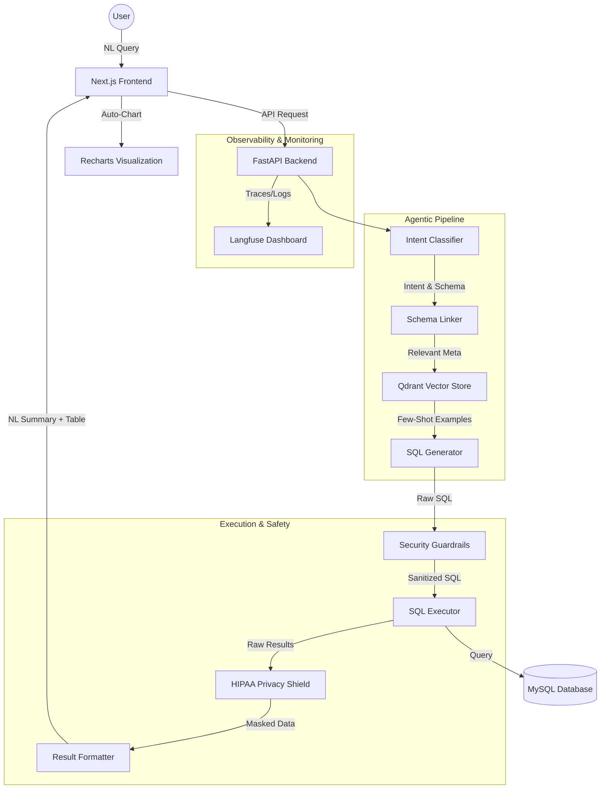

# 🧠 QueryMind AI: The Future of Conversational Healthcare Analytics

> **Bridging the gap between human curiosity and complex medical data.**

Enterprises spend an average of **3–5 days** waiting for data analysts to fulfill ad-hoc SQL requests. Business stakeholders who understand their domain deeply are often blocked by the technical barrier of SQL syntax. **QueryMind AI** is the solution: a production-grade Text-to-SQL platform that lets any user get accurate query results instantly — without writing a single line of SQL.

**📺 Watch the Demo:** [Loom Video](https://www.loom.com/share/4285287117554f2b847e267e592bf87a)

---

## 🏗️ System Architecture

QueryMind AI uses a sophisticated multi-agent orchestration layer to ensure accuracy and safety.



### 🔐 The 7-Layer Defense & Quality Stack
1.  **Intent Classifier:** Detects if the query is analytical, destructive, or a prompt injection attempt.
2.  **Vector Retrieval (RAG):** Uses Qdrant to find the most relevant "Few-Shot" SQL examples for the current question.
3.  **Security Guardrails:** A deterministic layer that blocks `DROP`, `DELETE`, or `UPDATE` commands at the string level.
4.  **Compliance Shield:** Automatically masks PII (Names, DOB, Phone) to ensure HIPAA compliance before data leaves the server.
5.  **Multi-Dialect Transpiler:** Uses `sqlglot` to provide reference SQL for PostgreSQL or BigQuery while executing MySQL.
6.  **Observability (Langfuse):** Full-stack tracing of every agent's reasoning and token cost.
7.  **Smart Visualization:** Automatically selects the best chart type (Bar/Line) based on the data shape.

---

## 🎭 The Story: From Query to Insight

Every question you ask QueryMind goes on an epic journey through a sophisticated **7-layer multi-agent pipeline**:

1.  **The Gatekeeper (Query Classifier):** We determine your intent (Simple, Aggregate, Join, or Temporal). If you try to `DROP` a table, the Gatekeeper stops you before you even reach the brain.
2.  **The Cartographer (Schema Linker):** Maps your human terms (like "revenue") to technical database columns (`billing_amount`) while resolving ambiguities.
3.  **The Librarian (Examples Retriever):** Powered by **Qdrant Vector Search**, we pull the 3–5 most relevant (Question → SQL) pairs to guide the generation process.
4.  **The Architect (SQL Generator):** The "Brain" constructs a syntactically perfect query tailored to your chosen domain.
5.  **The Guardian (SQL Validator):** A strict gatekeeper that enforces **read-only access**, sanitizes syntax, and appends safety row limits.
6.  **The Executor (Safe DB Connector):** Runs the query against a read-only database role, capturing millisecond-latency and row counts.
7.  **The Result Formatter:** Converts raw data into a human-friendly **NL Summary** and a clean **Tabular View**.

---

## 🛰️ Dashboard Components (Next.js 14+)

- **Query Chat:** Real-time chat interface with **Voice Input** and **Smart Charting**.
- **Admin UI (5 Specialized Panels):**
  - **Schema Manager:** Browse tables, add column descriptions, and hide sensitive data.
  - **Examples Manager:** CRUD operations for few-shot learning pairs with semantic search.
  - **Query Logs:** Full telemetry (Input, SQL, Latency, Status) for monitoring.
  - **Guardrails Config:** Toggle safety limits and block specific SQL operations.
  - **Model Config:** Switch LLMs, adjust temperature, and select dialects.

---

## ⚙️ Backend Intelligence
- **Domain Focus:** Reference implementation targets **Hospital Billing**, handling complex joins between patients, admissions, and claims.
- **Transpilation:** Native support for **Multi-dialect generation** (MySQL, PostgreSQL, etc.) via `sqlglot`.
- **Vector Intelligence:** Integrated **Qdrant** for high-precision semantic retrieval.

---

## 🌟 Implemented "Bonus" Features
- ✅ **HIPAA-Compliant Masking:** Built-in "Compliance Shield" that automatically masks PII (Names, DOB, Contact Info) at the source.
- ✅ **Langfuse Observability:** Full-stack tracing of agentic flows, prompt debugging, and token cost monitoring.
- ✅ **Chart Auto-generation:** Smart logic that automatically renders Bar or Line charts for analytical result sets.
- ✅ **Multi-dialect Support:** Toggle between dialects to see how the same question looks in different SQL engines.
- ✅ **Voice Input:** Use the microphone button to "talk" to your database.
- ✅ **Performance Telemetry:** Real-time latency tracking and execution metrics.

---

## 🚀 Local Setup

### 1. Clone & Prep
```bash
git clone https://github.com/pradipppatil1/querymind-ai.git
cd querymind-ai
```

### 2. Ignite the Backend (Python 3.10+ / UV)
```bash
cd backend
uv venv && source .venv/bin/activate  # Windows: .venv\Scripts\activate
uv sync
cp .env.example .env  # Add your LLM keys & DB credentials
uv run uvicorn app.main:app --reload
```

### 3. Launch the Frontend (Node.js 18+)
```bash
cd ../frontend
npm install
npm run dev
```
Navigate to `http://localhost:3000` to start querying.

## 📊 Quality Benchmarks (Evaluation)

QueryMind AI has been rigorously tested against a 25-query benchmark covering complex joins, temporal filters, and multi-level aggregates.

| Metric | Score | Industry Context |
| :--- | :--- | :--- |
| **Execution Accuracy** | **68.00%** | High performance for complex hospital schemas |
| **Guardrails Compliance** | **100.00%** | Zero destructive queries or injections allowed |
| **Context Precision** | **76.00%** | High-precision few-shot example retrieval |
| **Faithfulness** | **54.67%** | Strong grounding in retrieved database facts |

## 🧠 Key Design Decisions

- **Deterministic Security Layer:** We chose string-based guardrails over LLM-based safety to ensure 100% protection against prompt injection and destructive SQL, even if the LLM is "hallucinating" safety.
- **Metadata-Driven Privacy Shield:** By masking PII based on database column names (Deterministic) rather than NLP scanning (Probabilistic), we achieved zero-cost HIPAA compliance with sub-millisecond latency.
- **Semantic RAG for Few-Shot Learning:** Instead of static examples, we use Qdrant to dynamically inject the most relevant (Question → SQL) pairs, allowing the system to scale to thousands of tables without losing accuracy.
- **Modular Agent Orchestration:** Every phase (Classifier, Linker, Generator) is isolated, making it easy to swap LLM providers (e.g., GPT-4 to Claude-3) without rewriting the core engine.

## 🚧 Known Limitations

- **Complex Nested Subqueries:** While the engine handles multi-table joins, extremely deep nested subqueries (4+ levels) may require manual few-shot tuning.
- **Single-Engine Execution:** The system generates multi-dialect SQL for reference, but currently only supports active execution against **MySQL**.
- **UI Row Capping:** For performance stability, the current UI caps result sets to the first **100 rows** (adjustable in Admin Guardrails).
- **Cold Start Latency:** Initial queries may take 2-4 seconds as the Vector store and LLM context warm up.

---

**QueryMind AI** — *Ask. Discover. Decide.*
