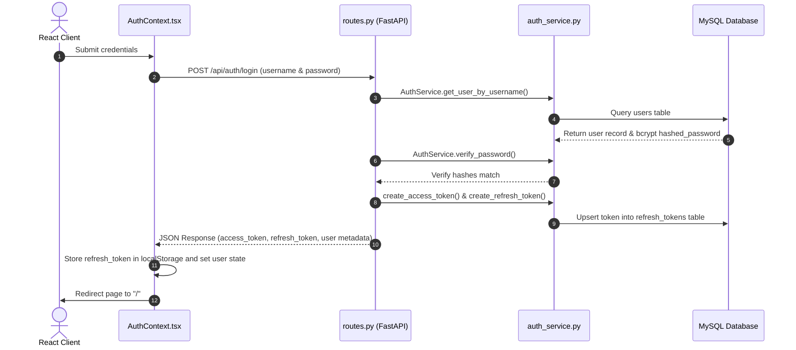
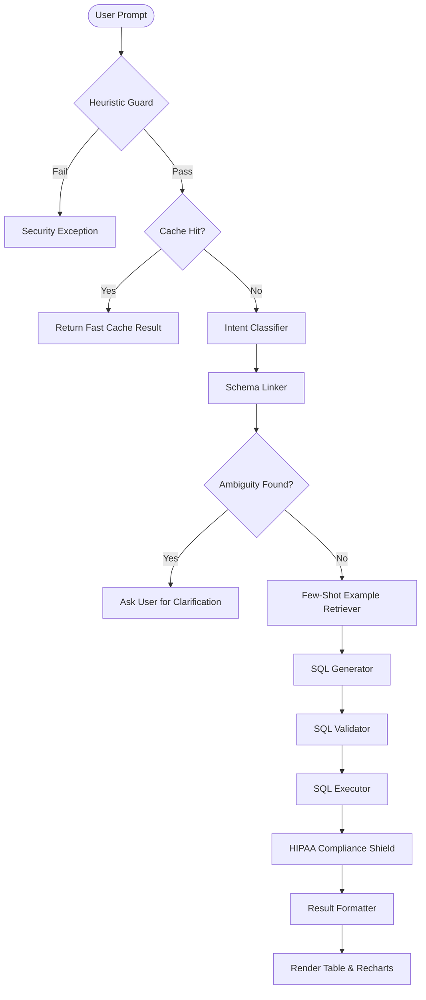

# 🧠 QueryMind AI: End-to-End Technical Architecture & System Flow

This document provides a highly detailed, comprehensive walkthrough of the QueryMind AI application. It is designed to give engineers a complete technical and conceptual understanding of the codebase, routing pathways, data structures, and pipeline modules so they can troubleshoot, scale, or modify the system with ease.

---

## 🏗️ 1. System Architecture & Module Map

### 📂 File System Layout

The application follows a clean separation of concerns between a Next.js (TypeScript) frontend and a FastAPI (Python) backend.

```text
text-2-sql-app/
├── frontend/
│   ├── src/
│   │   ├── app/
│   │   │   ├── layout.tsx         # Next.js global layout, fonts, and HTML wrappers
│   │   │   ├── page.tsx           # Main Chat Interface (Recharts / Table rendering)
│   │   │   └── login/
│   │   │       └── page.tsx       # Authentication login page UI
│   │   ├── context/
│   │   │   └── AuthContext.tsx    # React context managing auth states, refresh intervals, and custom fetch interceptor
│   │   ├── components/
│   │   │   ├── navbar.tsx         # Header navigation panel & theme controller
│   │   │   └── PasswordResetModal.tsx
│   │   └── lib/
│   │       └── utils.ts           # Tailwind CSS merging utilities
├── backend/
│   ├── app/
│   │   ├── main.py                # FastAPI Application startup, CORS configuration, and middleware definition
│   │   ├── api/
│   │   │   └── routes.py          # HTTP Endpoints, route parameter definitions, and path dependencies
│   │   ├── database/
│   │   │   └── mysql_client.py    # MySQL connector client managing connection pooling
│   │   ├── core/
│   │   │   └── observability.py   # Langfuse callback context provider
│   │   └── services/
│   │       ├── auth_service.py    # BCrypt password hashing & JWT generation/verification
│   │       ├── chat_service.py    # Handles chat sessions & persistent database messaging
│   │       ├── cache.py           # Qdrant client managing semantic caching
│   │       ├── security.py        # Heuristic Injection detection & safety regex rules
│   │       ├── classifier.py      # LLM agent categorizing query intent (simple, join, aggregate)
│   │       ├── schema_linker.py   # LLM agent linking human prompts to tables/columns
│   │       ├── retriever.py       # Qdrant client pulling relevant structural few-shot SQL templates
│   │       ├── generator.py       # SQL synthesis agent
│   │       ├── validator.py       # sqlglot parser checking read-only permissions and limits
│   │       ├── executor.py        # Runs verified SQL and catches syntax or semantic execution errors
│   │       ├── compliance_shield.py# HIPAA-compliant PII masking engine (regex-based)
│   │       ├── formatter.py       # Natural language answer summarization agent
│   │       └── dialect_transpiler.py# sqlglot-powered query translator (PostgreSQL, BigQuery, etc.)
```

---

## 🔐 2. Authentication, Authorization & JWT Lifecycle

### Flow Diagram



### 1. Rendering & Submission
*   **File:** [`frontend/src/app/login/page.tsx`](file:///d:/codebasics/AI%20for%20software%20engineer/texttosql/text-2-sql-app/frontend/src/app/login/page.tsx)
    *   **Components:** `LoginPage` renders a form using shadcn/ui.
    *   **State Hooks:** Uses standard `useState` hooks to track `username`, `password`, `error`, and `loading`.
    *   **Submission Handler:** `handleSubmit(e)` intercepts standard browser form behavior, triggers `loading = true`, and invokes the custom authentication handler `login(username, password)`.

### 2. Client-Side Authentication State
*   **File:** [`frontend/src/context/AuthContext.tsx`](file:///d:/codebasics/AI%20for%20software%20engineer/texttosql/text-2-sql-app/frontend/src/context/AuthContext.tsx)
    *   **Method:** `login(username, password)`
        1.  Dispatches a POST request to `http://localhost:8000/api/auth/login`.
        2.  Receives access and refresh tokens.
        3.  Sets the short-lived token in state: `setAccessToken(data.access_token)`.
        4.  Sets the long-lived refresh token in persistent memory: `localStorage.setItem("refresh_token", data.refresh_token)`.
        5.  Updates the active profile: `setUser(data.user)`.
        6.  Redirects the client to the workspace base url: `router.push("/")`.
    *   **Method:** `fetchWithAuth(url, options)`
        This function wraps standard requests to attach active credentials dynamically:
        1.  Checks if the access token has expired or is missing.
        2.  If missing, triggers `refreshAccessToken()` to renew the session using the stored refresh token.
        3.  Adds the bearer credential to the headers: `Authorization: Bearer <accessToken>`.
        4.  If the backend returns a `401 Unauthorized` response, `fetchWithAuth` intercepts it, triggers a refresh, and retries the request seamlessly.
    *   **Method:** `refreshAccessToken()`
        1.  Triggers a POST request containing the current token to `/api/auth/refresh`.
        2.  Updates `accessToken` in state on success.
        3.  Logs out and clears the session if the refresh token is expired or invalid.

### 3. Backend Verification & Token Management
*   **File:** [`backend/app/api/routes.py`](file:///d:/codebasics/AI%20for%20software%20engineer/texttosql/text-2-sql-app/backend/app/api/routes.py)
    *   **Endpoint:** `/auth/login`
        1.  Receives the `LoginRequest` payload.
        2.  Calls `auth_service.get_user_by_username()` to search the database.
        3.  Calls `auth_service.verify_password()` to verify the hashed password using Bcrypt.
        4.  Creates the JSON Web Tokens:
            *   `auth_service.create_access_token()`: Generates a JWT signed with `HS256` and containing a 30-minute expiration timestamp (`ACCESS_TOKEN_EXPIRE_MINUTES`).
            *   `auth_service.create_refresh_token()`: Generates a 7-day refresh token and records it in the database via the `_store_refresh_token` method.
        5.  Records the login time: `auth_service.update_last_login(username)`.
        6.  Returns the tokens and user metadata (e.g., role, username) to the client.

*   **File:** [`backend/app/services/auth_service.py`](file:///d:/codebasics/AI%20for%20software%20engineer/texttosql/text-2-sql-app/backend/app/services/auth_service.py)
    *   **Method:** `verify_password(plain, hashed)`: Standard Bcrypt check via `passlib.context.CryptContext`.
    *   **Method:** `create_access_token(data)`: Signs the payload using the `jose.jwt` library and the server's `SECRET_KEY`.
    *   **Method:** `create_refresh_token(data)`: Signs the refresh token and stores it in the `refresh_tokens` database table.
    *   **Method:** `verify_refresh_token(token)`: Decodes the token, checks the signature, and verifies that it is active in the database and has not expired.

---

## 💬 3. Natural Language Query Pipeline

This pipeline details how natural language is converted into validated, secure SQL results with smart visualizations.

### Pipeline Flow Diagram



### End-to-End Execution Flow

#### Step 1: Input Intake (Client Dashboard)
*   **File:** [`frontend/src/app/page.tsx`](file:///d:/codebasics/AI%20for%20software%20engineer/texttosql/text-2-sql-app/frontend/src/app/page.tsx)
    The user enters a question (e.g., *"Show total revenue by year"*) in the input field. `handleSubmit` is called, packaging the input and calling `/api/query` using the authenticated fetch helper `fetchWithAuth()`.

#### Step 2: Request Entrypoint (FastAPI Controller)
*   **File:** [`backend/app/api/routes.py`](file:///d:/codebasics/AI%20for%20software%20engineer/texttosql/text-2-sql-app/backend/app/api/routes.py)
    *   **Method:** `handle_query(request: QueryRequest, current_user = Depends(get_current_user))`
        The endpoint extracts the query and coordinates execution across the underlying services.

#### Step 3: Semantic Cache Check
*   **File:** [`backend/app/services/cache.py`](file:///d:/codebasics/AI%20for%20software%20engineer/texttosql/text-2-sql-app/backend/app/services/cache.py)
    *   **Method:** `SemanticCache.get(query)`
        1.  Translates the raw user query into a vector representation using OpenAI's `text-embedding-3-small` model.
        2.  Performs a similarity search in the `semantic_cache` collection in Qdrant.
        3.  If a cached entry has a cosine similarity score $\ge 0.95$, the cached result is returned immediately, bypassing the LLM pipeline.

#### Step 4: Security Inspection (Prompt Injection Check)
*   **File:** [`backend/app/services/security.py`](file:///d:/codebasics/AI%20for%20software%20engineer/texttosql/text-2-sql-app/backend/app/services/security.py)
    *   **Method:** `SecurityGuard.check_query(query)`
        Performs regex checks on the query. If a prompt injection attempt is detected, it blocks execution and throws a security exception.

#### Step 5: Intent Classification
*   **File:** [`backend/app/services/classifier.py`](file:///d:/codebasics/AI%20for%20software%20engineer/texttosql/text-2-sql-app/backend/app/services/classifier.py)
    *   **Method:** `QueryClassifier.classify(query, history)`
        Uses the LLM's structured output capability to classify the query type as `SELECT_SIMPLE`, `SELECT_AGGREGATE`, `SELECT_JOIN`, `SELECT_TEMPORAL`, `UNSUPPORTED`, or `PROMPT_INJECTION`. It returns a list of target tables and columns found in the prompt.

#### Step 6: Schema Mapping & Linking
*   **File:** [`backend/app/services/schema_linker.py`](file:///d:/codebasics/AI%20for%20software%20engineer/texttosql/text-2-sql-app/backend/app/services/schema_linker.py)
    *   **Method:** `SchemaLinker.link(...)`
        Compares recognized user terms with database documentation. If ambiguous references are detected (e.g. mapping "cost" to `procedures.cost` vs `billing_records.total_amount`), the linker logs them to `ambiguities`.
        *   *Self-Correction Guard:* If ambiguities are found, the backend pauses execution and returns a clarification request directly to the client.

#### Step 7: Few-Shot Example Retrieval
*   **File:** [`backend/app/services/retriever.py`](file:///d:/codebasics/AI%20for%20software%20engineer/texttosql/text-2-sql-app/backend/app/services/retriever.py)
    *   **Method:** `ExamplesRetriever.retrieve(query)`
        Queries Qdrant to find up to 5 verified Question-to-SQL structural examples matching the user's intent.

#### Step 8: SQL Query Generation
*   **File:** [`backend/app/services/generator.py`](file:///d:/codebasics/AI%20for%20software%20engineer/texttosql/text-2-sql-app/backend/app/services/generator.py)
    *   **Method:** `SQLGenerator.generate(...)`
        Compiles the system prompt using database schemas, context limits, few-shot examples, and chat history. Generates a standard MySQL `SELECT` query.

#### Step 9: Safety & Syntax Validation
*   **File:** [`backend/app/services/validator.py`](file:///d:/codebasics/AI%20for%20software%20engineer/texttosql/text-2-sql-app/backend/app/services/validator.py)
    *   **Method:** `SQLValidator.validate(sql)`
        Performs structural analysis using `sqlglot`:
        1.  Verifies the query is read-only (blocks `INSERT`, `DELETE`, etc.).
        2.  Checks permissions against allowed table prefixes.
        3.  Appends a fallback `LIMIT 100` if no limit is present.
        *   *Self-healing logic:* If validation fails, `routes.py` passes the error back to `SQLGenerator.generate()` to heal the SQL query.

#### Step 10: Query Execution
*   **File:** [`backend/app/services/executor.py`](file:///d:/codebasics/AI%20for%20software%20engineer/texttosql/text-2-sql-app/backend/app/services/executor.py)
    *   **Method:** `SQLExecutor.execute(sql)`
        Runs the verified query against the database using the database client [`backend/app/database/mysql_client.py`](file:///d:/codebasics/AI%20for%20software%20engineer/texttosql/text-2-sql-app/backend/app/database/mysql_client.py) and captures execution latency.

#### Step 11: HIPAA PII Shielding
*   **File:** [`backend/app/services/compliance_shield.py`](file:///d:/codebasics/AI%20for%20software%20engineer/texttosql/text-2-sql-app/backend/app/services/compliance_shield.py)
    *   **Method:** `ComplianceShield.mask_rows(results)`
        Applies regex rules to sensitive columns to ensure HIPAA compliance before returning data:
        *   **Names:** Redacts to initials (e.g., `J***n`).
        *   **DOB:** Keeps the year, redacts month and day (e.g., `1994-XX-XX`).
        *   **Phones/SSN/Emails:** Replaced with generic tokens.

#### Step 12: NL Summarization
*   **File:** [`backend/app/services/formatter.py`](file:///d:/codebasics/AI%20for%20software%20engineer/texttosql/text-2-sql-app/backend/app/services/formatter.py)
    *   **Method:** `ResultFormatter.format(...)`
        Passes a sample of the results to the LLM to generate a natural language summary of the answer.

#### Step 13: Multi-Dialect Transpilation
*   **File:** [`backend/app/services/dialect_transpiler.py`](file:///d:/codebasics/AI%20for%20software%20engineer/texttosql/text-2-sql-app/backend/app/services/dialect_transpiler.py)
    *   **Method:** `transpile_all(sql, active_dialects)`
        Uses `sqlglot` to translate the query into PostgreSQL or BigQuery syntax for user reference in the UI.

#### Step 14: UI Chart Visualization & Rendering
*   **File:** [`frontend/src/app/page.tsx`](file:///d:/codebasics/AI%20for%20software%20engineer/texttosql/text-2-sql-app/frontend/src/app/page.tsx)
    *   **Method:** `getChartConfig(results)`
        Checks if the result set meets the requirements for a visualization:
        1.  **Strict Constraint Check:** Counts columns (`keys.length <= 2`).
        2.  **Type Check:** Verifies at least one column contains numeric values.
        3.  **Visualization Choice:** Returns a configuration object setting the chart to a **Bar Chart** (for comparisons/small datasets) or a **Line Chart** (for larger time-series trends).

---

## 🛠️ 4. Admin Portal Architecture

The Admin Portal is a separate, secured route used to manage configuration, audit logs, and clean up the database.

### 1. Access Route Guards
*   **Frontend Routing:** [`frontend/src/context/AuthContext.tsx`](file:///d:/codebasics/AI%20for%20software%20engineer/texttosql/text-2-sql-app/frontend/src/context/AuthContext.tsx)
    If a user tries to access `/admin` paths but does not have the admin role (`user.role !== 'ADMIN'`), they are immediately redirected back to the home page `/`.
*   **Backend Guards:** [`backend/app/api/routes.py`](file:///d:/codebasics/AI%20for%20software%20engineer/texttosql/text-2-sql-app/backend/app/api/routes.py)
    Admin endpoints use FastAPI dependencies to enforce role-based access control:
    ```python
    def get_admin_user(current_user: dict = Depends(get_current_user)):
        if current_user.get("role") != "ADMIN":
            raise HTTPException(status_code=403, detail="Admin privileges required")
        return current_user
    ```

### 2. Core Admin Capabilities & Endpoint Map

| Action | Endpoint | Python File & Function | Operation |
| :--- | :--- | :--- | :--- |
| **Inspect System Logs** | `GET /admin/logs` | `routes.py` -> `get_logs()` | Fetches execution history, query latencies, and generated SQL from MySQL. |
| **Get Target Schema** | `GET /admin/schema` | `routes.py` -> `get_schema()` | Exposes schema context to the Admin Console. |
| **Manage Few-Shot Examples** | `POST /admin/examples` | `routes.py` -> `add_example()` | Validates and pushes new structural few-shot examples to Qdrant. |
| **System Settings** | `POST /admin/config` | `routes.py` -> `update_config()` | Updates active SQL dialects and LLM options. Saves changes to the `system_config` table. |
| **Guardrails Policy** | `POST /admin/guardrails`| `routes.py` -> `update_guardrails()` | Configures maximum query limits and table security prefix policies. |

---

## 📝 5. Reference Guide: Common Debugging Scenarios

Use this reference to resolve common system and integration issues:

### 1. Login fails on correct credentials
*   **What to check:** Check [`auth_service.py`](file:///d:/codebasics/AI%20for%20software%20engineer/texttosql/text-2-sql-app/backend/app/services/auth_service.py) -> `verify_password()`.
*   **Root Cause:**
    *   MySQL service is offline or misconfigured in the `.env` settings.
    *   The `users` table password hashes are out of sync. You can fix this by running the backend setup script:
        ```bash
        uv run scripts/setup_auth.py
        ```

### 2. SQL execution fails with syntax or semantic errors
*   **What to check:** Check [`validator.py`](file:///d:/codebasics/AI%20for%20software%20engineer/texttosql/text-2-sql-app/backend/app/services/validator.py) and [`generator.py`](file:///d:/codebasics/AI%20for%20software%20engineer/texttosql/text-2-sql-app/backend/app/services/generator.py).
*   **Root Cause:**
    *   The LLM generated an invalid SQL dialect or referred to non-existent columns.
    *   *Fix:* Check and update the schema context metadata passed to `SQLGenerator`. You can inspect the schema configuration through the Admin console: `GET /admin/schema`.

### 3. The chart does not render or is blank
*   **What to check:** Check `getChartConfig` in [`page.tsx`](file:///d:/codebasics/AI%20for%20software%20engineer/texttosql/text-2-sql-app/frontend/src/app/page.tsx).
*   **Root Cause:**
    *   **Column Count Check:** Recharts auto-generation only triggers when results have $\le 2$ columns.
    *   **Data Types:** Y-axis values must be cast using `Number()` in Javascript to scale correctly.
    *   **Styling Issues:** Verify that chart colors are using standard hex variables (e.g., `var(--primary)`) rather than HSL syntax wrappers (e.g., `hsl(var(--primary))`).
